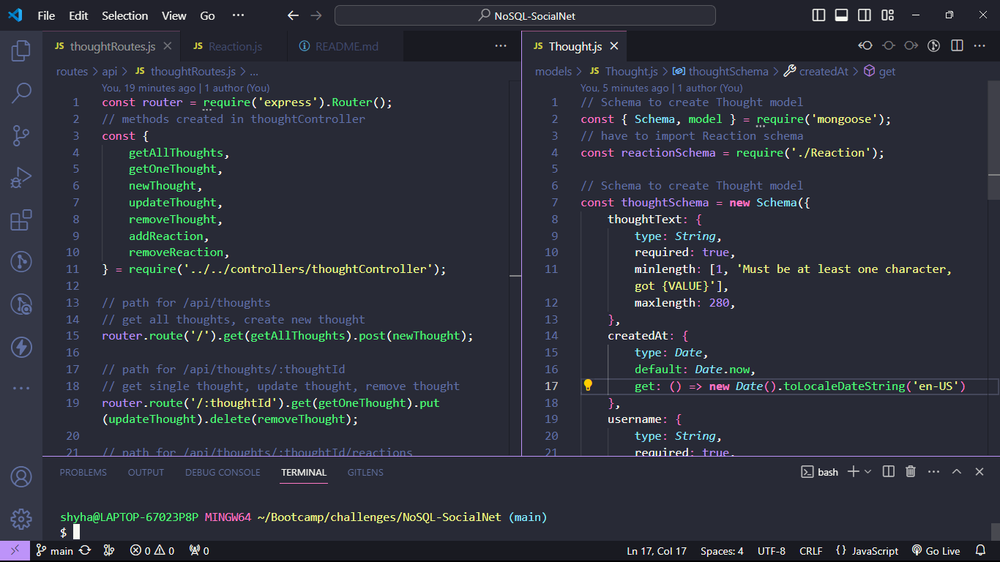

# NoSQL-Social Network App

## Description
The requirement of this challenge, was to build an API for a social network application. We were required to make use of MongoDB, Mongoose ODM and Express.js, and additionally HTTPie to make API requests. MongoDB was used to create a database of Users and Thoughts that were created using the Mongoose model constructor. Users are also able to both add and remove friends and reactions. I made use of two separate controllers: one for Users and another for Thoughts. These controllers contain methods that are exported, and then imported via the thoughtRoutes.js and userRoutes.js files, and used for proper routing. The purpose of this challenge was to test our ability to create a properly structured and functional API, as well as making use of our understanding of NoSQL databases.

## Screenshot
  
  
  

## Links
[GitHub Repo]('https://github.com/sailorshy94/NoSQL-SocialNet')  
[Walkthrough Video]()